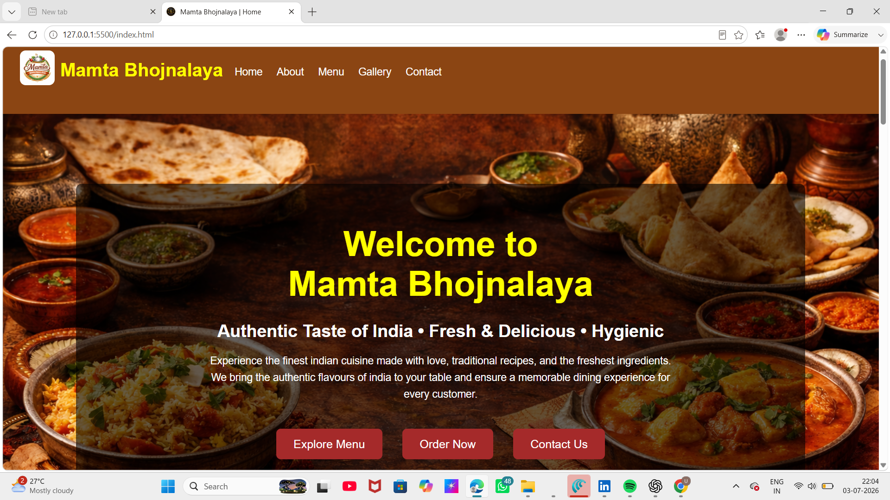
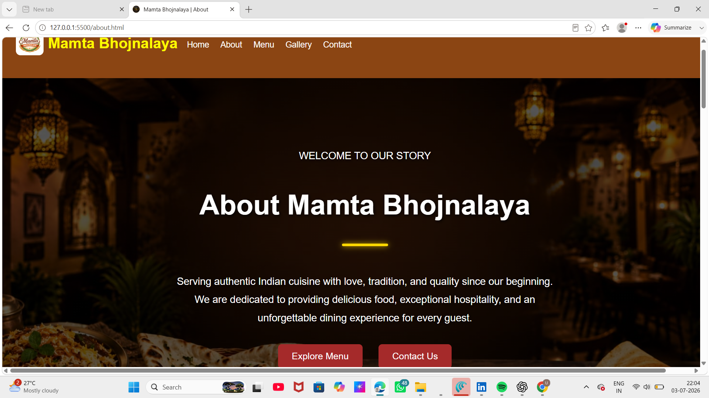
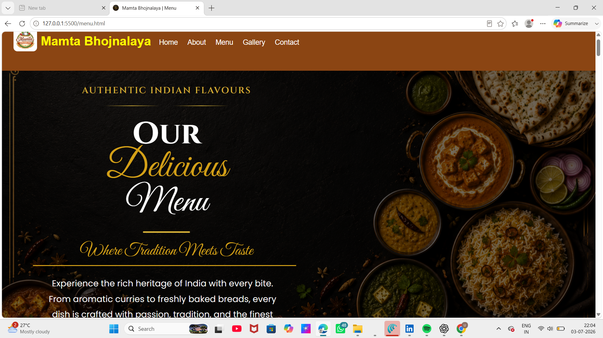
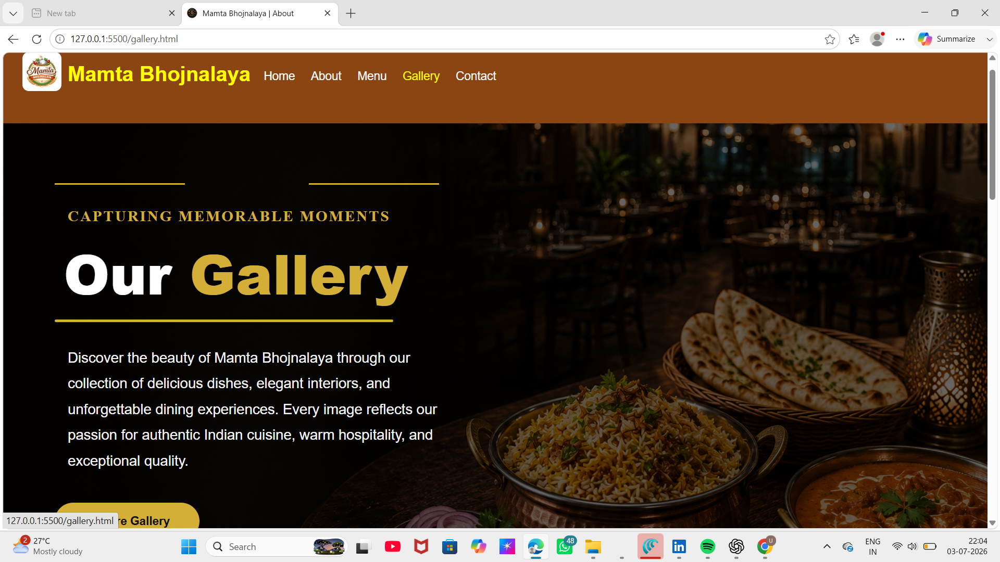
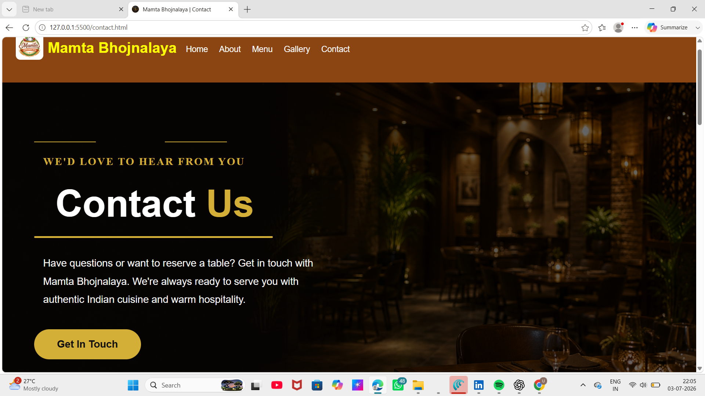

# 🍽️ Mamta Bhojnalaya Restaurant Website

## 📖 Project Description

Mamta Bhojnalaya is a responsive restaurant website developed using HTML, CSS, and JavaScript. The website provides information about the restaurant, menu, gallery, contact details, and customer reviews with a modern and user-friendly interface.

---

## ✨ Features

- Responsive Navigation Bar
- Home Page
- About Page
- Restaurant Menu
- Food Gallery
- Contact Page
- Customer Reviews
- Google Maps

---

## 🛠️ Technologies Used

- HTML5
- CSS3
- JavaScript
- Google Maps Embed

---

## 📂 Project Structure

Mamta-Bhojnalaya/
│
├── index.html
├── about.html
├── menu.html
├── gallery.html
├── contact.html
├── style.css
├── README.md
│
├── images/
│   ├── logo.png
│   ├── favicon.png
│   ├── home-banner.jpg
│   ├── menu-banner.jpg
│   ├── gallery-banner.jpg
│   ├── contact-banner.jpg
│   ├── food1.jpg
│   ├── food2.jpg
│   ├── restaurant1.jpg
│   ├── special1.jpg
│   └── ...

---

## 📱 Responsive Design

This website is fully responsive and works on:

- 💻 Desktop
- 💻 Laptop
- 📱 Tablet
- 📱 Mobile

---

## 🚀 How to Run the Website

1. Download or clone this repository.
2. Open the project folder.
3. Double-click `index.html` or open it using any modern web browser.
4. Navigate through the website using the navigation bar.

No additional software or installation is required.

---

## 📸 Screenshots

### Home Page

### About Page

### Menu Page

### Gallery Page

### Contact Page

## 👩‍💻 Author

**Name:** Uppu Madhavi

**Project:** Mamta Bhojnalaya Restaurant Website

---

## 📜 License

This project was developed for educational and academic purposes only.